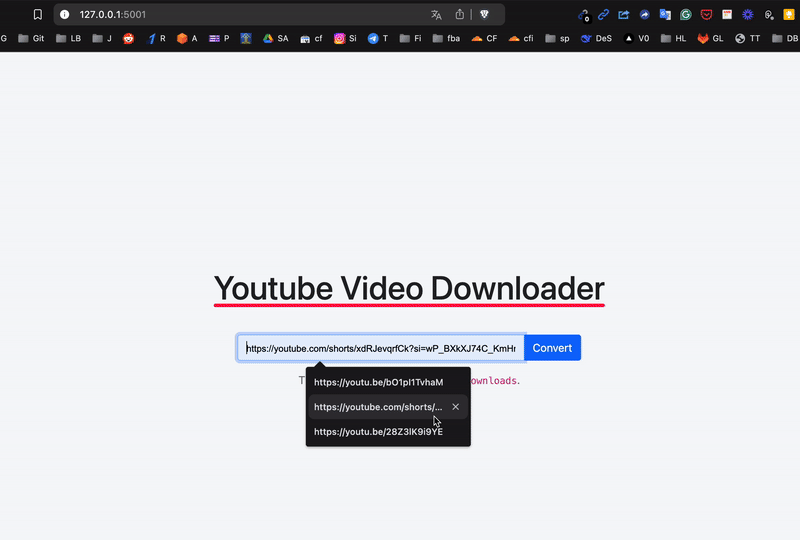

# Youtube Video Download - to - Text-Conversion 🎥🔠



**Who needs boring URLs when you can have your videos wrapped up in style?** This project, powered by Flask and a sprinkle of magic from [yt-dlp](https://github.com/yt-dlp/yt-dlp), delivers a sleek interface for downloading YouTube videos (and other supported platforms). Your downloaded treasures land right in the cozy folder `./downloads` get converted into Texts. You can then push this file into blog / articles, as you want to process it ahead.

---

## 💻 Getting Started: Pre-flight Checklist

**Before you dive in, make sure you have:**

- Python 3.12+ (We don’t accept dinosaurs)
- pip (Because Python packages don’t install themselves)
- Docker (Optional: if you want to make your life *extra* smooth)

---

## 🚀 Installation and Running the Show

### 1. Running Locally (a.k.a. Old School)

1. **Grab the code like it’s hot:**
   ```bash
   git clone https://github.com/sachnaror/Youtube_Video_Downloader.git
   cd flask-youtube-downloader
   ```

2. **Set up your private Python fortress:**
   ```bash
   python3 -m venv env
   source env/bin/activate
   ```

3. **Stock up on the essentials:**
   ```bash
   pip install -r requirements.txt
   ```

4. **Hit the launch button:**
   ```bash
   python run.py
   ```

5. **Behold the glory:**
   Open your browser and point it to [http://localhost:5000](http://localhost:5000).

---

### 2. Running with Docker Compose (a.k.a. Fancy Pants Mode)

1. **Prepare yourself with Docker and Docker Compose installed.**

2. **Pull the code (yes, same as above, keep up):**
   ```bash
   git clone https://github.com/sachnaror/Youtube_Video_Downloader.git
   cd flask-youtube-downloader
   ```

3. **Let Docker do its thing:**
   ```bash
   docker compose up --build
   ```

4. **And voilà:**
   Open [http://localhost:5000](http://localhost:5000) and bask in the beauty of instant video downloads.

---

## 📦 Features Galore

- **Paste and Go:** Simply paste your video URL, hit the button, and enjoy the magic.
- **Auto-download Brilliance:** No complicated clicks—your video lands safely in `./downloads`.
- **User-Friendly Interface:** Designed for humans, not robots (though they’ll probably like it too).

---

## 🔧 Tech Ingredients

- **Flask:** The cool uncle of Python web frameworks.
- **yt-dlp:** Your trusty sidekick for video fetching.
- **HTML, CSS, JS:** A dash of webby goodness for the front-end.
- **Docker:** Keeping everything tidy and portable.

---

## Directory Structure

```
├── flask_youtube_downloader/
│   ├── run.py
│   ├── requirements.txt
│   ├── Dockerfile
│   ├── README.md
│   ├── docker-compose.yml
│   ├── video_to_markdown.py
│   └── screenshots/
│   ├── app/
│   │   ├── utils.py
│   │   └── routes.py
│   │   ├── static/
│   │   │   ├── favicon.ico
│   │   │   ├── scripts.js
│   │   │   └── style.css
│   │   ├── templates/
│   │   │   ├── index.html
│   │   │   └── add_video.html
│   ├── downloads/
│   │   ├── Medical Imaging with AI!.wav_chunk1.wav
│   │   ├── Medical Imaging with AI!.wav_chunk0.wav
│   │   ├── Medical Imaging with AI!.webm
│   │   ├── Medical Imaging with AI!.wav_chunk2.wav
│   │   ├── Medical Imaging with AI!.wav_chunk3.wav
│   │   ├── Medical Imaging with AI!.wav
│   │   └── Medical Imaging with AI!.txt
```

---

## 🔧 Common Issues and Solutions

**Error:**
```plaintext
python run.py
 * Serving Flask app 'app'
 * Debug mode: off

Address already in use

Port 5000 is in use by another program. Either identify and stop that program, or start the server with a different port.
On macOS, try disabling the 'AirPlay Receiver' service from System Preferences -> General -> AirDrop & Handoff.
```

**Solution:**

1. **Identify the conflicting process:**
   Open a terminal and run:
   ```bash
   lsof -i :5000
   ```
   This command shows you which process is using port 5000.

2. **Stop the process using port 5000:**
   Note the process ID (PID) from the previous step, then run:
   ```bash
   kill -9 <PID>
   ```
   This will free up the port so Flask can use it.

3. **Choose a different port (if needed):**
   If stopping the process isn’t possible, you can run Flask on another port:
   ```bash
   python run.py --port 5001
   ```

4. **Disable macOS services (if applicable):**

   If you’re on macOS, the AirPlay Receiver service might be using port 5000.

   - Go to **System Preferences** → **General** → **AirDrop & Handoff**.
   - Turn off **AirPlay Receiver** and retry running your Flask app.

---

## **📩 Contact**

| Name              | Details                             |
|-------------------|-------------------------------------|
| **👨‍💻 Developer**   | Sachin Arora                      |
| **📧 Email**       | [schnaror@gmail.com](mailto:schnaror@gmail.com) |
| **📍 Location**    | Noida, India                       |
| **🗂 GitHub**      | [github.com/sachnaror](https://github.com/sachnaror?tab=repositories&q=&type=public&language=&sort=) |
| **🌐 Website**     | [https://about.me/sachin-arora](https://about.me/sachin-arora) |
| **📱 WhatsApp**    | [WhatsApp Me](https://wa.me/919560330483?text=Hello%20Sachin) |
| **🎦 YouTube**     | [youtube.com/@sachnaror4841/videos](https://www.youtube.com/@sachnaror4841/videos) |
| **🗴 Twitter**     | [twitter.com/sachinhep](https://twitter.com/sachinhep) |
| **✍️ Medium**      | [medium.com/@schnaror](https://medium.com/@schnaror) |

Need help, got feedback, or just want to say hi? Reach out to me here:

- GitHub: [sachnaror](https://github.com/sachnaror)
- Email: [schnaror@gmail.com](mailto:schnaror@gmail.com)

Now, go forth and enjoy downloading videos with a touch of wit! 😄
